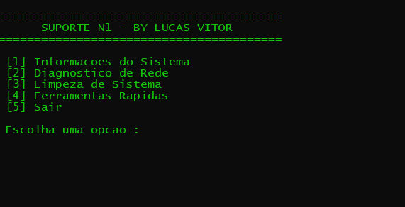

# 🖥️ Suporte N1 - PowerShell Tools

    

**Status:** ✅ Em Desenvolvimento  

Esse projeto foi desenvolvido com **PowerShell**, com o objetivo de agilizar e automatizar tarefas rotineiras de suporte técnico nível 1 (N1). A aplicação oferece uma interface interativa no terminal, permitindo realizar diagnósticos de rede, limpeza de sistema e acesso rápido a ferramentas administrativas.

## 🔧 Tecnologias Utilizadas

- **PowerShell**: Linguagem principal para automação das tarefas.
- **WMI & CMD**: Utilizados para coleta de informações e execução de comandos do sistema.

## 📌 Funcionalidades Atuais

✔️ **Get-SystemInfo**: Exibe informações do sistema, como nome do computador, usuário, IP e espaço em disco.  
✔️ **Test-NetworkDiagnostics**: Realiza testes e diagnósticos de rede (ping, flush DNS, renew IP).  
✔️ **Clear-SystemTemp**: Limpa arquivos temporários da máquina para liberar espaço.  
✔️ **Start-QuickTools**: Acesso rápido ao Painel de Controle, Gerenciador de Tarefas, Dispositivos e Serviços.  
✔️ **Menu Interativo**: Interface de linha de comando simples e intuitiva para o operador.

## 🚀 Funcionalidades em Desenvolvimento

🔹 **Relatório em TXT/CSV**: Exportação de resultados para análise posterior.  
🔹 **Instalador de Softwares Essenciais**: Automatizar instalação via Winget.  
🔹 **Detecção de Programas Críticos**: Verificar se programas importantes estão instalados.  
🔹 **Log de Atividades**: Registrar tudo que foi executado para auditoria.  

